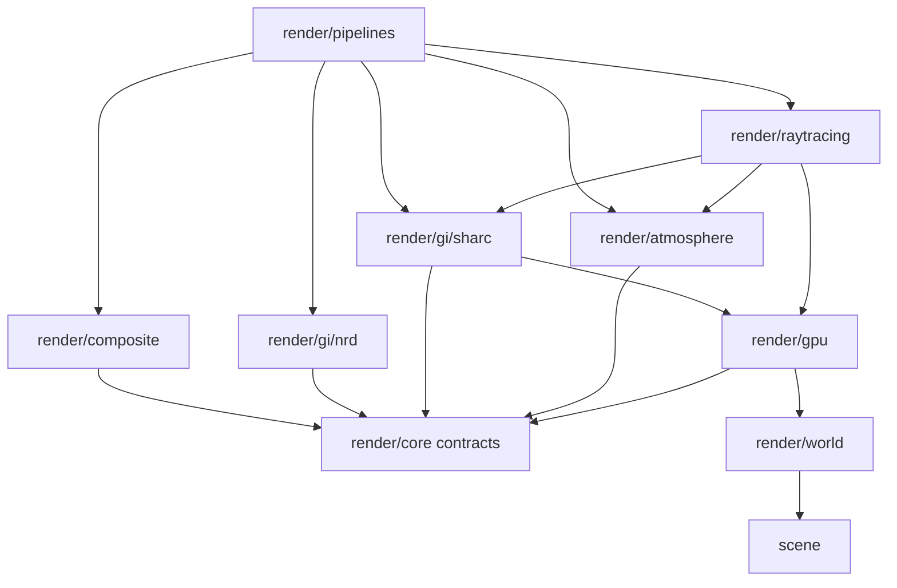
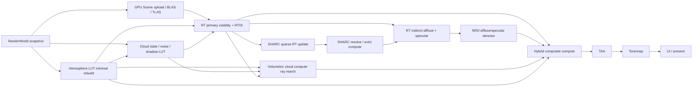

# Lumin Engine Hybrid Rendering 完整实施计划

## 1. 目标

本计划在允许 breaking change 的前提下，将支持光线追踪的主渲染路径重构为以下 Hybrid Rendering 管线：

1. 使用 camera primary ray 直接求交场景并生成表面信息。
2. 使用 RT shadow ray 计算太阳和场景灯光的 Direct Lighting，不读取 CSM。
3. 使用独立的稀疏 RT pass 更新 SHARC 世界空间辐射缓存，再由 RT indirect pass 查询已 resolve 的缓存。
4. 使用 NRD 对 diffuse/specular indirect radiance-hit-distance 信号进行时空去噪。
5. 使用 compute shader 生成大气 LUT，并以全屏 compute ray marching 计算体积云。
6. 在统一 Composite 中按深度正确组合 RT direct、SHARC indirect、NRD 输出、大气与体积云。
7. 支持 RT 的 Hybrid 路径不创建、不录制、不绑定 raster G-buffer、CSM 或 deferred-lighting pass。
8. 不支持完整 RT/SHARC/NRD 能力的设备保留现有 raster deferred fallback。

本文是后续实现的唯一执行计划。现有 `docs/rendering-overhaul-plan.md` 继续作为已完成架构迁移的历史记录，
不再承担本轮 pass、资源 ABI 和验收状态的定义。

## 当前实现状态（2026-08）

- [x] `DeferredRenderPipeline` 支持 Raster/Hybrid 两套固定拓扑；Hybrid 不注册 CSM、G-buffer 和旧 deferred direct Feature。
- [x] RTDI primary surface、RT shadow、miss atmosphere、surface signal ABI 和 UAV 资源契约已接入。
- [x] GPU Scene 的 candidate upload/BLAS/TLAS 更新已移动到 `hybrid-surface` Feature，并遵守 submit commit/discard 事务。
- [x] SHARC update/query、RT GI 和 NRD 已改为消费 primary RT surface signals。
- [x] 新增 Hybrid compute composite，将 RT direct 与 NRD indirect 合成为 TAA 输入；GI 关闭时支持 direct-only，SSAO
  fallback 时支持 direct × packed ambient visibility。
- [x] RT surface 命中距离统一使用 `position.w > 0` 作为有效几何判定，修复近距离命中被误判为 miss 的问题。
- [x] 帧图颜色、surface signal 和 TAA 资源显式声明末尾 `ShaderResource` 状态，避免 frame slot 复用时的 Vulkan
  layout 漂移；RTDI motion 补齐当前 jitter UV 偏移并与 raster motion 对齐。
- [x] shader manifest ABI 校验通过，当前 debug 构建启用 35 个 shader entries；完整 CTest 35/35 通过。
- [ ] 体积云 ray marching、weather/noise 资源和云阴影尚未实现。
- [ ] Composite 的大气深度合成和云/天空 view-ray marching 尚未实现；当前 RT miss 使用共享 atmosphere LUT/procedural fallback。

## 2. 非目标

- 不使用 RT Core 加速大气或云。二者是参与介质积分，固定采用 compute shader ray marching。
- 第一版不实现 path-traced reference renderer、ReSTIR DI/GI、双向路径追踪或多 GPU。
- 第一版不实现透明物体、折射材质和带 alpha-test 的多层 primary visibility；先保证不透明几何闭环。
- 第一版不对确定性太阳硬阴影做 NRD。若后续增加随机面积光源，单独接入 NRD SIGMA 或专用 direct-light
  denoiser，不能把 direct 与 indirect history 混在一起。
- 不移植 Alpha-Piscium 的 GPLv3 shader、绑定、常量布局、噪声资产或项目专用算法。
- 不要求 Hybrid RT 与 raster fallback 逐像素一致；要求坐标、材质、曝光和太阳方向语义一致。

## 3. 固定架构不变量

- `VulkanContext` 仍是唯一原生 Vulkan 平台边界，Feature 优先通过 NvRHI 记录命令。
- 所有运行时资源访问、布局、stage、access mask 和 pass 依赖均由 `FrameGraph` 声明。
- 不引入 `VkRenderPass` 或原生 framebuffer；fallback 图形通道继续使用 Vulkan 1.3 dynamic rendering。
- 每帧槽资源只能在 `VulkanContext::beginFrame()` 等待对应 fence 后更新或重绑。
- `RenderWorldSnapshot` 是 GPU Scene、RTDI、SHARC、NRD 和 atmosphere/cloud 的唯一场景输入。
- 每个跨帧系统都采用 begin/commit/discard 事务；只有 queue submit 成功后推进历史或 generation。
- CPU/Slang 共享结构必须是显式对齐的稳定 ABI，并由 shader reflection 测试验证 offset、size 和 binding。
- 公共 C++ API 使用简体中文 Doxygen；shader 中只给非显然数学、坐标变换和同步契约添加中文注释。
- 外部 SDK 固定到精确 submodule commit，configure/build 阶段不得联网下载。

## 4. 最终模块与依赖方向

下图的箭头表示“消费者依赖提供者”：



禁止的依赖方向：

- `GpuScene` 不依赖 GI、NRD、atmosphere 或 Composite。
- `SharcRadianceCache` 不依赖 NRD。
- `NrdDenoiser` 不知道 SHARC；它只消费标准 denoiser signal contract。
- atmosphere/cloud 不依赖 RT pipeline；它们只消费相机、深度、太阳、LUT 和天气参数。
- Composite 不创建上游资源，也不推进任何上游 history。
- Hybrid pipeline 不复用 `DeferredRenderPipeline` 内部的 G-buffer 或 shadow 资源。

建议的最终目录如下：

```text
render/
  core/                       # FrameGraph、Feature、blackboard、history、capabilities
  gpu/                        # GPU Scene、BLAS/TLAS 和稳定 descriptor
  raytracing/
    RtSurfaceSignals.hpp      # primary-ray 表面与 direct-lighting 契约
    RtDirectLighting.hpp      # primary visibility + RTDI
    RtIndirectLighting.hpp    # diffuse/specular indirect rays
  gi/
    SharcRadianceCache.hpp
    NrdDenoiser.hpp
  atmosphere/
    AtmosphereLutGpu.hpp
    VolumetricClouds.hpp
    AtmosphereComposite.hpp
  pipelines/
    HybridRenderPipeline.hpp
    RasterFallbackPipeline.hpp

shaders/
  include/                    # GPU Scene、材质、相机、NRD 和大气公共 ABI
  raytracing/
    rt_direct.slang
    rt_indirect.slang
  gi/
    sharc_update.slang
    sharc_resolve.slang
  atmosphere/
    *.slang                   # 四张 LUT
    CloudNoise.slang
    CloudShadow.slang
    VolumetricClouds.slang
  composite/
    hybrid_composite.slang
```

迁移完成后删除或改名当前仍表达 G-buffer 输入的 `RayTracedGiFrameInputs`、`RayTracedGiFrameGraphInputs` 和
`GiCompositeResources::position/normalRoughness/albedoMetallic`。当前未接入构建的
`RayTracedDirectLightingPass` 原型不得直接成为公共 ABI，应在阶段 1 中由新资源契约替换。

## 5. Capability tier 与运行时选择

| Tier | 必要能力 | 运行路径 |
| --- | --- | --- |
| `RasterFallback` | Vulkan 1.3 dynamic rendering | G-buffer + CSM + deferred + SSAO/TAA |
| `HybridRt` | acceleration structure、RT pipeline、BDA、descriptor indexing、SHARC 所需 int64/float16、NRD 所需 compute 能力 | RTDI + SHARC + RT indirect + NRD + atmosphere/cloud compute |
| `HybridRtDebugRaw` | 与 `HybridRt` 相同 | 跳过 NRD 或 SHARC 的诊断路径，不作为自动选择结果 |

`Auto` 只有在完整 `HybridRt` 能力集合可用时才选择 Hybrid。生产路径不静默拼出“有 RTDI、无 SHARC”或
“有 SHARC、无 NRD”的半配置；这些组合只用于构建测试和调试。显式请求 Hybrid 但能力不足时记录缺失能力并安全
回退，不创建任何 RT/SHARC/NRD 资源。

## 6. Hybrid 帧图



固定 pass 顺序：

1. `gpu-scene-upload`、`blas-build-or-update`、`tlas-build-or-update`。
2. 按 signature 最小重建 `atmosphere-transmittance`、`atmosphere-multi-scattering`、
   `atmosphere-sky-view`、`atmosphere-aerial-perspective`。
3. `cloud-noise/weather` 和 `cloud-shadow-lut`；前者仅 seed/参数变化时生成，后者仅天气、太阳或云时间步
   变化时更新。
4. `rt-direct-lighting`：primary visibility、材质重建、太阳/灯光 shadow ray、表面信号输出。
5. `sharc-clear`，仅 `FullReset` 时执行。
6. `sharc-update`：从稀疏 primary surface 发射独立 RT workload，更新 accumulation。
7. `sharc-resolve`：resolve、stale eviction、lock 清理和统计。
8. `rt-indirect-lighting`：发射 diffuse/specular ray，只查询本帧已经 resolve 的 SHARC cache。
9. NRD 内部 dispatch 链：处理 diffuse/specular radiance-hit-distance。
10. `volumetric-cloud-raymarch` 与 `volumetric-cloud-reconstruct`。
11. `hybrid-composite`：组合 surface、indirect、atmosphere、cloud。
12. TAA、tonemap、UI、present。

验收时必须从实际 FrameGraph dump 验证：`HybridRt` 中不存在 `gbuffer`、`shadow-cascade-*`、
`deferred-lighting` pass，RT binding reflection 中也不存在 G-buffer/CSM texture。

## 7. `RtSurfaceSignals` 资源契约

primary RT pass 必须一次性产生所有下游需要的 surface signals。它们是 ray tracing 的命中输出，不得命名为
G-buffer，也不得由 raster pass 生成。

| 资源 | 建议格式 | 空像素值 | 消费者 |
| --- | --- | --- | --- |
| `worldPositionHitT` | `RGBA32_FLOAT` | `xyz=0, w=-1` | SHARC update、cloud clipping、debug |
| `normalRoughness` | `R10G10B10A2_UNORM` 或 NRD 配置要求的格式 | 法线编码零、roughness=1 | RT indirect、NRD、Composite |
| `albedoMetallic` | `RGBA8_UNORM`，线性 | `0` | RT indirect、Composite |
| `materialId` | `R32_UINT` | `0xffffffff` | 材质调试、后续重建 |
| `viewZ` | `R32_FLOAT` | NRD 规定的 background 值 | NRD、cloud reconstruction、Composite |
| `motion` | `RG16_FLOAT` | `0` | NRD、cloud temporal、TAA |
| `directRadiance` | `RGBA16_FLOAT` | sky miss 不写 surface direct | Composite |
| `visibilityMask` | `R8_UINT` | `0` | 所有需要区分 hit/miss 的 pass |

实现约束：

- `worldPositionHitT.w` 是从相机到 primary hit 的 world-space 距离；miss 使用负值，不能用最大浮点数混充。
- `viewZ`、normal encoding、roughness 和 hit-distance 必须严格符合当前 NRD `LibraryDesc`。
- motion 在整个引擎中统一为 `previousUv - currentUv`，单位为 screen UV，已移除 current/previous jitter。
  TAA 统一使用 `previousUv = currentUv + motion`；现有 raster fallback、G-buffer shader 和测试在同一阶段完成
  breaking migration，禁止长期保留两套相反符号。
- primary hit 由 barycentric、instance transform、vertex/index buffer 与 `GpuMaterialData` 重建。
- 当前和上一成功提交的 instance transform 都进入 `GpuInstanceData`，用于真实物体运动矢量。
- surface signals 按帧槽拥有；同一帧中通过唯一 `FrameGraphResourceHandle` 在各 Feature 间传递。
- `RenderBlackboard` 发布强类型 `RtSurfaceSignalData`，禁止下游按字符串查找纹理。

## 8. RT Direct Lighting

### 8.1 Ray pipeline

`rt_direct.slang` 包含：

- `rayGenerationMain`：生成带当前 TAA jitter 的 camera primary ray。
- `primaryMissMain`：写 miss mask，并从共享 Sky-view LUT 计算背景方向所需的 sky radiance 元数据。
- `primaryClosestHitMain`：重建 world position、shading normal、material 和 motion。
- `shadowMissMain`：标记太阳/灯光可见。
- 第一版不需要 any-hit；加入 alpha-test 后再增加独立 hit group。

recursion depth 第一版固定为 2：primary ray 加一层 shadow ray。shadow ray 使用
`TerminateOnFirstHit | SkipClosestHitShader`，`TMin` 使用几何尺度相关的法线偏移，`TMax` 对太阳为无穷远、对点光为
光源距离减 epsilon。

### 8.2 光照模型

- `SurfaceModel::BlinnPhong` 使用共享 base color、specular color 和 shininess。
- `SurfaceModel::MetallicRoughness` 使用 GGX/Smith/Schlick。
- direct pass 对每个确定性灯光发射 visibility ray；第一版限定一个太阳加一个小型 punctual-light 数组。
- 太阳辐照度先乘大气 Transmittance LUT；启用云时再乘 `CloudShadowLut`。
- miss 只标记 background，最终天空/云颜色在 Composite 中生成，避免 direct pass 与 Composite 重复曝光。
- primary direct 不写入 SHARC，不与 indirect radiance 相加后再送入 NRD。

### 8.3 验收

- 单三角形 hit/miss、背面、非均匀缩放法线、材质索引和运动矢量测试通过。
- 遮挡物移动会改变 RT shadow，Hybrid FrameGraph 中无 CSM。
- Blinn-Phong 与 PBR 分别有固定相机 golden scene；允许算法差异，不允许 NaN/Inf 或负 radiance。
- shader reflection 证明 set 中只有 TLAS、GPU Scene、灯光、大气、输出和 constants。

## 9. SHARC RT 间接光

### 9.1 为什么 update 是独立 RT pass

SHARC query 与 update 的采样分布和写入语义不同，必须保持独立：

- primary/indirect pass 每个有效像素读取 resolved cache，目标是稳定着色。
- update pass 每个 `sparseTileSize x sparseTileSize` tile 只选择一个像素，继续追踪路径并原子写
  hash/accumulation/lock，目标是摊薄世界空间 cache 更新成本。
- resolve pass 把 accumulation 转成只读 resolved representation，并执行 stale eviction。
- 若在同一个 RT dispatch 内先 update 再 query，Vulkan 不保证不同 invocation 的全局完成顺序，也无法在中间插入
  完整的 UAV barrier；query 会看到部分新、部分旧的数据。

因此本轮固定顺序是 `SHARC update RT -> SHARC resolve compute -> RT indirect query`。三者是同一个间接光系统，
独立 pass 是并行执行和同步正确性的要求，不是另一套 GI。

### 9.2 数据流

`sharc-update` 从 `RtSurfaceSignals` 中稀疏选择有效 primary hit，在该点采样 bounce direction。二次 hit 计算太阳
RT visibility、材质响应和 atmosphere miss；生成的样本写入 SHARC accumulation。cache 中保存的是可供任意查询点
复用的间接入射/出射辐射信息，不保存 primary direct output。

`sharc-resolve` 读取 hash/accumulation 并写 resolved，同时更新 occupancy/overflow。`rt-indirect-lighting` 的二次 hit
只读 resolved cache；query miss 时使用受限的单次 direct estimate 或 environment，不能返回未初始化值。

### 9.3 同步与历史

FrameGraph 必须推导并在测试中观察到：

```text
RT shader write accumulation/lock/statistics
  -> compute shader read-write resolve/evict
  -> RT shader read resolved/statistics
```

- 首帧、camera cut、拓扑或 geometry 变化：`FullReset`。
- material、灯光、大气或 cloud-shadow generation 变化：`ResponsiveDecay`。
- 稳定帧：`Preserve`，按 stale counter 驱逐。
- resize 不必清空世界空间 cache，但必须重建稀疏选择序列和帧尺寸常量。
- submit 失败：不得推进 cache frame index、previous camera 或 responsive window。

保留现有 `queryHitCount/updateCount/overflowCount/occupancyCount` 统计，新增 GPU timestamp 和 cache reset reason。

## 10. RT Indirect Lighting

`rt_indirect.slang` 读取 `RtSurfaceSignals`，不再读取 position/normal/albedo/motion G-buffer。第一版每个有效 primary
surface 发射一个 cosine-weighted diffuse ray 和一个按 roughness 采样的 GGX specular ray：

- diffuse 输出 `diffuseRadianceHitDistance`，格式 `RGBA16_FLOAT`。
- specular 输出 `specularRadianceHitDistance`，格式 `RGBA16_FLOAT`。
- RGB 是 NRD 要求的未去噪 radiance；A 是通过 NRD helper 编码的 normalized hit distance。
- miss 从共享 atmosphere Sky-view LUT 取 environment radiance。
- hit 查询本帧 resolved SHARC；query miss 执行受限 fallback estimate。
- 采样使用按成功提交序号推进的 blue-noise/Sobol 序列，失败帧重试必须得到同一序列。
- diffuse 与 specular 分开保留 sample count、roughness cutoff 和最大追踪距离。

禁止将 primary direct 复制到 indirect 输出，也禁止让 Composite 再次乘一次 albedo。信号采用“已应用当前 primary
surface BRDF 的 radiance”还是“入射 irradiance”必须在 ABI 中二选一。第一版固定为已应用 BRDF 的 outgoing radiance，
Composite 只做相加和介质组合。

## 11. NRD 接入

第一版沿用现有 NRD `v4.17.3` adapter，使用 REBLUR diffuse/specular denoiser。输入映射为：

| NRD 输入 | 来源 |
| --- | --- |
| diffuse radiance-hit-distance | `rt-indirect-lighting` |
| specular radiance-hit-distance | `rt-indirect-lighting` |
| normal-roughness | `RtSurfaceSignals` |
| viewZ | `RtSurfaceSignals` |
| motion | `RtSurfaceSignals` |
| current/previous matrices、jitter | `RenderFrameIdentity` 与相机提交历史 |

规则：

- NRD 输出保持 diffuse/specular 分离，直到 Composite。
- background 像素不进入 denoiser history；miss mask 按 NRD 契约设置。
- camera cut、resize、拓扑、RT/NRD 开关、shader reload：diffuse/specular `FullReset`。
- material、灯光、大气、cloud-shadow：`SoftReset` 或 responsive accumulation；最终策略以稳定性场景测试确定。
- previous matrices、jitter 和 motion 都取最近一次成功提交帧，不取最近一次尝试录制帧。
- NRD permanent pool 跨帧持有，transient pool 由 adapter 管理；所有 dispatch 仍导入 FrameGraph 并关闭 NvRHI
  automatic barriers。
- 对 direct sun shadow 的降噪不复用这两条 history；未来软阴影使用独立 signal/domain。

验收覆盖 first frame、静止收敛、camera cut、resize、快速旋转、运动实例、disocclusion、GI toggle、失败帧重试和
至少 10 分钟运行。

## 12. 大气 LUT clean-room 实现边界

已有 Transmittance、Multi-scattering、Sky-view 和 Aerial Perspective LUT 继续作为唯一大气基础。算法与实现来源遵循
`docs/atmosphere-reference.md`：

- 可参考 Alpha-Piscium 可观察到的 pass 拓扑、尺寸、更新依赖和参数化行为。
- 不复制、翻译、逐行改写其 GPLv3 shader、binding、常量布局或噪声资源。
- Slang 实现基于 Hillaire 2020、Bruneton、MIT/Apache-2.0 参考独立编写。
- 继续使用 Y-up、千米单位和 `toSunWorld = normalize(-light.direction)`。
- LUT 只在对应 optical/surface/lighting/view signature 变化时最小重建。
- RT miss、SHARC update、cloud lighting 和 Composite 共享同一 atmosphere descriptor set。

当前四张 LUT 已有代码和测试，本轮先做 ABI/数值复核，不重新移植另一套 atmosphere。若现有结果不满足误差或
稳定性门槛，只在 clean-room 边界内修正。

## 13. 体积云 compute ray marching

### 13.1 数据模型

新增 `scene::VolumetricCloudParameters`，至少包含：

- 行星云层 bottom/top altitude。
- coverage、density、erosion、detail strength。
- base/detail noise scale、wind direction/speed、time scale。
- Henyey-Greenstein forward/backward anisotropy 和 silver-lining 参数。
- extinction、single-scattering albedo、powder effect 强度。
- ray-march steps、shadow steps、history blend、quality preset。

参数必须独立拥有 `cloudRevision`；动画时间推进不伪装成场景 topology change。

### 13.2 资源

| 资源 | 建议格式/尺寸 | 生命周期 |
| --- | --- | --- |
| `WeatherMap` | `RG8_UNORM`, 512x512 | 参数/seed 变化时 compute 生成 |
| `BaseNoise` | `RGBA8_UNORM`, 128x128x128 | 启动或 seed 变化时生成 |
| `DetailNoise` | `R8_UNORM`, 32x32x32 | 启动或 seed 变化时生成 |
| `CurlNoise` | `RG8_SNORM`, 128x128 | 启动或 seed 变化时生成 |
| `BlueNoise` | 固定宽松许可资产或程序生成 | 持久只读 |
| `CloudShadowLut` | `R16_FLOAT`, 512x512 | 太阳/天气/时间步变化时更新 |
| `CloudRadianceTransmittance` | `RGBA16_FLOAT`, 默认半分辨率 | 每帧槽 |
| `CloudDepthRange` | `RG16_FLOAT` 或 `RG32_FLOAT` | 每帧槽 |
| `CloudHistory` | 与输出同格式，ping-pong | 跨帧 |

噪声优先由确定性 compute 生成，避免测试依赖未纳入仓库的本地资产。引入外部 blue-noise 时必须记录许可证、来源、
hash 和升级方式。

### 13.3 Ray marching

- 每个 compute invocation 从 inverse view-projection 重建 world ray。
- 与球形云层 shell 求交，积分区间再由 primary `hitT` 截断；云位于不透明表面之后时不得显示。
- 使用 weather map 控制 coverage/type，用低频 Worley/Perlin 组合塑形，以 detail/curl erosion。
- 空区段使用 coarse stepping，命中密度后切换 fine stepping；最大步数由 quality preset 限制。
- 每个样本用 Transmittance LUT 计算太阳到样本的大气衰减，用短 secondary march 近似云自阴影。
- 多次散射使用能量守恒的低阶近似，参数与大气 Multi-scattering LUT 分开，避免重复计能。
- 第一版半分辨率执行，使用 blue-noise jitter、motion/viewZ/depth range 做 bilateral temporal reconstruction。
- camera cut、resize、FOV、云参数/seed 突变、时间跳跃和 feature toggle 清空 cloud history。

### 13.4 云阴影

`CloudShadowLut` 沿太阳方向积分云密度，表示地表/空气点到太阳的近似 cloud transmittance。RTDI 在 surface hit
位置采样它，使太阳 direct lighting 与天空中的云遮挡一致。该 LUT 不是 CSM，也不包含几何遮挡；几何遮挡仍由 RT
shadow ray 计算。

## 14. Composite 与深度顺序

`hybrid-composite` 是 compute pass，输出 scene-linear pre-exposed HDR。它不追踪 ray、不查询 SHARC、不推进 NRD 或
cloud history。

先定义前到后组合运算：

```text
(L1, T1) over (L2, T2) = (L1 + T1 * L2, T1 * T2)
```

其中 `L` 是 premultiplied in-scattered radiance，`T` 是 RGB transmittance。Composite 按如下情况处理：

- surface hit：基础表面辐射为 `Lsurface = Ldirect + LdiffuseIndirect + LspecularIndirect`。
- miss：背景为 Sky-view LUT 产生的 `Lsky`，不读取伪造 surface。
- 无云：使用 Aerial Perspective 的 `(Latm, Tatm)` 得到 `Latm + Tatm * Lsurface/Lsky`。
- 有云：cloud ray march 输出实际积分区间 `[dEntry, dExit]` 的 premultiplied radiance/transmittance；Composite
  将相机到云、云介质、云后到 surface/sky 的 atmospheric segments 按上述 over 运算组合。
- `dExit` 超过 primary `hitT` 时必须被截断；surface 前方的大气和云可见，surface 后方完全丢弃。

为了避免大气被重复积分，cloud 输出契约必须明确二选一。第一版采用“云段内同时积分 atmosphere + cloud”的 combined
segment：cloud pass 输出该区间的 combined `(L, T)`；Composite 从 Aerial Perspective cumulative LUT 提取云前和云后
的大气 segment，不能再对云区间应用一次 aerial perspective。

曝光只在 Composite 之后统一应用；LUT、RTDI、SHARC、NRD 和 cloud 都保持 scene-linear radiance。随后 TAA 消费
`RtSurfaceSignals.motion` 和 Composite HDR，Tonemap 再映射到交换链。

## 15. Blackboard 与 Feature 契约

新增或替换以下强类型 blackboard 数据：

| 数据类型 | 发布者 | 消费者 |
| --- | --- | --- |
| `GpuSceneFrameData` | GPU Scene Feature | RTDI、SHARC、RT indirect |
| `AtmosphereLutFrameData` | Atmosphere LUT Feature | RTDI、SHARC、cloud、Composite |
| `RtSurfaceSignalData` | RTDI Feature | SHARC、RT indirect、NRD、cloud、Composite |
| `SharcResolvedFrameData` | SHARC Feature | RT indirect |
| `RtIndirectSignalData` | RT indirect Feature | NRD |
| `DenoisedIndirectData` | NRD Feature | Composite |
| `VolumetricCloudFrameData` | Cloud Feature | Composite |
| `SceneHdrData` | Composite Feature | TAA/Tonemap |

每种类型必须同时携带物理 NvRHI handle、当前 FrameGraph handle、extent/format 和 ready pass。消费者只能复用该
FrameGraph handle，禁止二次 import 同一物理资源。

## 16. History、revision 与失效矩阵

新增 `HistoryDomain::RtIndirectSampling`、`HistoryDomain::CloudTemporal`；必要时把现有 NRD diffuse/specular 保持为
独立 domain。建议矩阵如下：

| 事件 | RT sample sequence | SHARC | NRD | Cloud | TAA | Atmosphere LUT |
| --- | --- | --- | --- | --- | --- | --- |
| first frame | reset | full | full | full | full | rebuild required set |
| camera cut | reset | full | full | full | full | view-dependent rebuild |
| resize | reset | preserve | full | full | full | view/extent-dependent rebuild |
| FOV/projection | reset | preserve | full | full | full | aerial/sky-view as required |
| topology/geometry | reset | full | full | preserve | full | preserve |
| instance transform | advance | responsive/full by severity | disocclusion | preserve | normal temporal | preserve |
| material | advance | responsive | soft/full | preserve | normal temporal | preserve |
| lighting/sun | advance | responsive | soft | responsive/full | responsive | lighting-dependent rebuild |
| atmosphere optical | advance | responsive | soft | full | responsive | dependent rebuild |
| cloud parameter/seed | advance | responsive via shadow generation | preserve indirect | full | responsive | preserve |
| RT/SHARC/NRD toggle | reset | full | full | preserve | full | preserve |
| shader reload | reset | full | full | full | full | affected LUT rebuild |
| failed submit | do not advance | discard | discard | discard | discard | abandon |

revision 比较以最近一次成功提交的 snapshot 为基线。动画云时间使用固定 simulation tick 和已提交 time index，保证失败帧
重试可重复。

## 17. 构建开关与 shader ABI

保留并收口以下 CMake gate：

```text
LUMIN_RAY_TRACING=AUTO|ON|OFF
LUMIN_ENABLE_SHARC=ON|OFF
LUMIN_ENABLE_NRD=ON|OFF
LUMIN_ENABLE_ATMOSPHERE=ON|OFF
LUMIN_ENABLE_VOLUMETRIC_CLOUDS=ON|OFF
```

依赖规则：

- `SHARC -> RAY_TRACING`。
- `NRD -> RAY_TRACING`。
- `VOLUMETRIC_CLOUDS -> ATMOSPHERE`。
- 完整 Hybrid runtime mode 要求五项全部启用；不完整组合只构建诊断/测试路径。
- atmosphere 关闭时 RT miss 使用显式 constant-environment shader variant，不保留悬空 set。

每个 shader companion JSON 为入口声明 `requires`、binding、ABI struct、include directory、capability 和输出；
构建目录中的 `shader-manifest.json` 由 `scripts/shader_manifest.py` 临时生成。
新增 ABI 测试必须检查：

- RTDI 完全没有 G-buffer/CSM binding。
- SHARC update 读取 `RtSurfaceSignals`，resolve/query 的读写属性正确。
- RT indirect、NRD 和 Composite 对格式及 normal/motion 约定一致。
- cloud 是 compute entry，不能出现 acceleration structure binding。
- atmosphere/cloud 的所有纹理维度、array/3D 类型和 sampler set 匹配 C++ layout。

现有 SHARC/NRD submodule 已满足依赖需求。本轮 atmosphere/cloud 不需要新增 submodule；若后续引入噪声或采样库，先完成
许可证审计再固定 commit。

## 18. 分阶段实施清单

### 阶段 0：冻结契约与基线

- [ ] 记录当前 Debug/Release build、CTest、shader ABI、Vulkan probe 和 sandbox validation 基线。
- [ ] 为 Hybrid FrameGraph 增加可机器检查的 pass dump。
- [ ] 冻结本文中的 motion、radiance、hit-distance、normal encoding 和 scene unit 约定。
- [ ] 标记现有 G-buffer 驱动的 RT GI/SHARC 接口为迁移目标，不在其上继续叠加功能。

门槛：当前测试继续通过；新增 contract 测试能明确指出现有 Hybrid 路径仍依赖 G-buffer。

### 阶段 1：Hybrid pipeline 与 surface ABI

- [ ] 新建 `HybridRenderPipeline`，与 `RasterFallbackPipeline` 在 capability 选择后互斥实例化。
- [ ] 实现 `RtSurfaceSignals`、逐帧资源所有权和 blackboard 数据。
- [ ] 扩展 GPU Scene previous transform、灯光数组和材质访问 ABI。
- [ ] 将 Hybrid、raster fallback、NRD、cloud temporal 和 TAA 的 motion 全部迁移为 `previous-current`。
- [ ] 删除 RTDI 临时原型，按最终契约重建 header/source/shader/manifest。
- [ ] 调整 `TextureManager`，Hybrid 模式不分配 G-buffer/CSM。

门槛：Hybrid 空管线可录制、提交、resize；资源分配测试证明没有 G-buffer/CSM image。

### 阶段 2：Primary RTDI

- [ ] 实现 primary ray、miss、closest-hit、shadow ray 和 surface signal 写入。
- [ ] 实现 Blinn-Phong/PBR direct BRDF、太阳与 punctual lights。
- [ ] 接入 atmosphere transmittance 和 cloud-shadow 的占位单位纹理。
- [ ] 完成 motion、jitter、camera cut 和 instance transform 测试。

门槛：RTDI 场景真实运行；FrameGraph/descriptor 中无 G-buffer/CSM；Vulkan validation 无错误。

### 阶段 3：SHARC 改接 RT surface

- [ ] 将 SHARC update 输入从 raster G-buffer 改为 `RtSurfaceSignals`。
- [ ] 固定 update -> resolve -> query barrier 和 pass dependency。
- [ ] 完成 query miss fallback、统计、responsive decay 与 full reset。
- [ ] 增加静态收敛、动态物体、灯光变化、overflow 和失败 submit 测试。

门槛：SHARC occupancy/query hit 随稳定帧合理收敛，缓存不出现 NaN/死锁/越界。

### 阶段 4：RT indirect 与 NRD

- [ ] 拆除旧 `RayTracedGiPass` 的 G-buffer 输入，建立独立 RT indirect pass。
- [ ] 输出 REBLUR diffuse/specular radiance-hit-distance。
- [ ] 复用 `RtSurfaceSignals` 的 normal/viewZ/motion 接入 NRD。
- [ ] 完成所有 history reset、disocclusion 和长时间运行验证。

门槛：raw/denoised 可切换对照，NRD history 稳定，SHARC query 确实来自本帧 resolved cache。

### 阶段 5：大气 LUT 复核与体积云

- [ ] 复核现有四 LUT 的数值、格式、signature 和共享 descriptor。
- [ ] 增加 cloud 参数/revision、确定性 noise 生成和资源管理。
- [ ] 实现 cloud-shadow LUT、半分辨率 ray march 和 temporal reconstruction。
- [ ] 使用 primary hit distance 做深度截断，加入大气太阳衰减。

门槛：昼夜、云层内外、地面/高空相机、云在几何前后、resize/cut 场景正确；cloud pass 无 RT binding。

### 阶段 6：Hybrid Composite 与后处理

- [ ] 用 compute `hybrid-composite` 替代 Hybrid 模式下的 sky/deferred/GI composite 三段旧流程。
- [ ] 实现 surface/miss、aerial segment、cloud segment 的前到后组合。
- [ ] 统一 scene-linear/pre-exposure，接回 TAA、tonemap 与 UI。
- [ ] 增加 debug view：direct、raw indirect、denoised diffuse/specular、SHARC、LUT、cloud transmittance/depth。

门槛：无 double lighting、无 atmosphere double integration、无云穿透前景、曝光切换稳定。

### 阶段 7：收口、性能与文档

- [ ] 删除 Hybrid 路径的 G-buffer/CSM/deferred 兼容接缝和旧 shader entries。
- [ ] 保证 raster fallback 独立通过测试。
- [ ] 完成 GPU timestamp、资源内存、ray count、SHARC 与 NRD 统计面板。
- [ ] 更新 `README.md`、架构、shader ABI、调试、依赖和公共 API 中文文档。
- [ ] 完成 Debug/Release、feature matrix、validation 和实际 RTX sandbox 验证。

门槛：满足第 21 节完成定义。

## 19. 测试与验证矩阵

### CPU/contract 测试

- surface format、alignment、binding、invalid sentinel 和 motion sign。
- capability tier、feature dependency、fallback 选择和资源不创建保证。
- FrameGraph pass 顺序及 update/resolve/query barrier。
- 各 history domain 的 begin/commit/discard 与失效矩阵。
- atmosphere/cloud 参数校验、LUT signature 和 deterministic noise seed。

### Shader ABI 测试

- manifest 中每个 entry 的 stage、set、binding、array size、format expectation 和 ABI struct。
- 修改公共 Slang include 会重编译全部消费者。
- `LUMIN_RAY_TRACING/SHARC/NRD/ATMOSPHERE/VOLUMETRIC_CLOUDS` 组合过滤正确。

### Vulkan GPU 测试

- primary hit/miss/shadow、BLAS update/TLAS update。
- SHARC clear/update/resolve/query 及统计 readback。
- NRD first frame/cut/resize/disocclusion。
- LUT generation、cloud noise、cloud ray march、composite 输出均非空且无 NaN/Inf。
- validation layer 无 descriptor、layout、lifetime、同步和 SBT 错误。

### 图像回归场景

- 室内 Cornell 风格场景：检查 diffuse bounce、漏光和 SHARC 收敛。
- 高光球阵列：检查 specular roughness 与 NRD 稳定性。
- 室外太阳场景：检查 RT shadow、大气 transmittance 和 cloud shadow 对齐。
- 地平线/高空/大气外相机：检查球壳相交和 LUT 边界。
- 云遮挡前景/背景：检查 surface hitT 截断和深度重建。
- 快速相机与移动物体：检查 motion、disocclusion、TAA/NRD/cloud history。

### 构建矩阵

至少执行：

```text
Debug:   full Hybrid
Release: full Hybrid
Debug:   LUMIN_RAY_TRACING=OFF
Debug:   LUMIN_ENABLE_SHARC=OFF
Debug:   LUMIN_ENABLE_NRD=OFF
Debug:   LUMIN_ENABLE_ATMOSPHERE=OFF
Debug:   LUMIN_ENABLE_VOLUMETRIC_CLOUDS=OFF
```

关闭任一功能时不得编译、加载或反射其被过滤的 shader；完整 Hybrid 和 raster fallback 都必须能启动 sandbox。

## 20. 风险、性能预算与诊断

主要风险及预先确定的处理方式：

| 风险 | 早期信号 | 处理方式 |
| --- | --- | --- |
| NRD/TAA motion 或 jitter 符号不一致 | 转动相机时拖影方向相反 | 单一 CPU/Slang helper、解析样例和运动可视化测试 |
| SHARC query 读取未 resolve 数据 | 闪烁、帧间随机亮点 | 固定 pass dependency，FrameGraph barrier contract 测试 |
| direct/indirect 或 atmosphere 重复计能 | 能量随 feature toggle 明显跳变 | 固定 outgoing-radiance ABI，逐项 Composite debug view |
| 云与几何深度错误 | 云穿过前景或遮挡近物体 | 使用 primary `hitT` 截断并回归边界像素 |
| cloud ray marching 超预算 | 低覆盖天空仍耗时很高 | shell/天气空跳、半分辨率、adaptive steps、GPU 统计 |
| SHARC/NRD/云历史污染 | cut/resize 后残影 | 分域 revision 和 submit-only commit，失败帧重试测试 |
| GPU Scene/历史资源增长 | 长时间运行显存持续上升 | 逐帧槽稳定分配计数和 10 分钟 soak test |
| Alpha-Piscium 许可证污染 | 实现出现同构 binding/代码片段 | clean-room 审计、来源记录和独立 review |

第一轮优化目标以 RTX 4060、1920x1080、60 Hz、Release 为测量基线，不作为尚未测量前的正确性门槛：

| 阶段 | 初始预算 |
| --- | ---: |
| RT primary + direct shadows | 2.5 ms |
| SHARC sparse update + resolve | 1.5 ms |
| RT diffuse/specular indirect | 2.5 ms |
| NRD | 2.0 ms |
| cloud shadow + half-res cloud/reconstruct | 3.0 ms |
| Hybrid Composite | 0.5 ms |

总 Hybrid 特性预算目标不超过 12 ms，为 TAA、tonemap、UI、GPU Scene 更新和尖峰保留余量。LUT 重建是低频工作，
正常稳定帧不应重复执行；重建尖峰需记录独立 timestamp。

必须暴露以下统计：

- primary/shadow/diffuse/specular ray count、hit rate 和最大递归深度。
- BLAS/TLAS rebuild/update 次数与耗时。
- SHARC occupancy、query hit、update、overflow、reset reason。
- NRD dispatch 总耗时、history reset reason。
- cloud coarse/fine step 平均数、空采样比例、history rejection 和 ray-march 分辨率。
- 每个持久/逐帧资源的字节数与总显存。
- 每个 FrameGraph pass 的 GPU timestamp。

性能优化顺序固定为：先减少无效 dispatch/ray/step，再降低内部解析度或样本数，最后才改变算法。任何优化不得绕过
FrameGraph barrier、帧槽 fence 或 history 事务。

## 21. 完成定义

只有以下条件全部满足，本计划才能标记完成：

1. 支持设备实际运行 `RT Direct Lighting + SHARC RT Indirect + NRD + Atmosphere + Volumetric Clouds`。
2. Hybrid FrameGraph dump 中没有 G-buffer、CSM、deferred lighting；相关 RT/compute shader 没有这些 binding。
3. RTDI 产生完整 `RtSurfaceSignals`，SHARC update/resolve/query 顺序和 barrier 经过 GPU/contract 测试验证。
4. NRD 使用 RT 生成的 normal/viewZ/motion 和 indirect radiance-hit-distance，并正确处理全部历史失效事件。
5. cloud 由全屏 compute ray marching 生成，受 primary hit distance 截断，并与大气、surface 按深度正确合成。
6. Alpha-Piscium 仅作为 clean-room 行为参考，新增代码和资产具有明确、可分发的来源与许可证记录。
7. 无完整 RT 能力的设备自动进入 raster fallback，且不会创建未启用功能的资源。
8. Debug/Release 全量 CTest、shader ABI、feature gate 构建矩阵和 Vulkan validation 全部通过。
9. RTX 设备 sandbox 连续运行至少 10 分钟，无 validation error、资源持续增长、NaN/Inf 或 history 闪烁。
10. README、架构、调试说明及所有新增公共 API 的简体中文文档完成。
